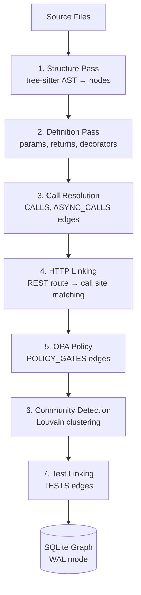

# code-graph

Persistent code knowledge graph MCP server for Claude Code. Structural analysis via tree-sitter AST parsing with a Cypher-like query language.

Originally forked from [DeusData/codebase-memory-mcp](https://github.com/DeusData/codebase-memory-mcp). Substantially extended with security surface analysis, STIG evidence queries, interprocedural graph reachability, cross-service HTTP linking, dead code detection, change coupling from git history, Louvain community clustering, and more.

## Why This Exists

Semantic search (code-search) finds code by *meaning* — ask "where is the auth middleware?" and get ranked results. But it can't answer structural questions: "What calls this function?", "If I change this, what breaks?", "Is this function dead code?"

Those questions require understanding the *structure* of the codebase — the call graph, import chains, type hierarchies, HTTP route bindings, and file co-change patterns. That's what code-graph provides: a persistent knowledge graph built from tree-sitter ASTs that you can query with Cypher.

**The token savings are dramatic.** Answering "what calls `authenticate()`?" with grep/Glob requires reading every file that contains the word "authenticate", then manually tracing which usages are actual function calls vs. comments, strings, or variable names. For a 50K-line repo, that's ~80K tokens of context. A single code-graph query returns the precise answer in ~500 tokens — a **160x reduction**.

The graph persists in SQLite across sessions. Index once, query forever (with automatic incremental re-indexing when files change).

## How It Works

### Multi-Pass Indexing Pipeline

Indexing a repository runs through 7 sequential passes, each building on the previous:




1. **Structure pass**: tree-sitter parses every file into an AST. Extracts packages, files, modules, classes, functions, methods, interfaces, enums, and type definitions as graph nodes. Creates `CONTAINS_*` and `DEFINES` edges for the containment hierarchy.

2. **Definition pass**: Resolves function/method definitions with parameters, return types, and decorators. Go gets enhanced LSP-style type resolution for cross-package calls.

3. **Call resolution pass**: Walks AST call expressions and resolves them to definition nodes using import-aware, type-inferred matching. Creates `CALLS`, `ASYNC_CALLS`, and `USAGE` edges. This is where the call graph is built — the core value of the tool.

4. **HTTP linking pass**: Discovers REST routes (FastAPI `@app.get`, Gin `router.GET`, Express `app.get`) and matches them to call sites that make HTTP requests to those routes. Creates `HTTP_CALLS` edges that connect microservices across repo boundaries.

5. **OPA policy pass**: Links OPA policy files to the code they gate. Creates `POLICY_GATES` edges from policy decisions to enforced endpoints.

6. **Community detection**: Runs Louvain clustering to identify natural module boundaries in the graph. Useful for understanding which parts of the codebase form cohesive units.

7. **Test linking pass**: Identifies test files and creates `TESTS` edges from test functions to the production code they exercise.

### 27 Languages via Tree-Sitter

Every language is parsed using vendored tree-sitter C grammars compiled via CGO. Language specs in `internal/lang/` map tree-sitter node types to graph concepts (which AST nodes become Function nodes, which become Class nodes, etc.).

The full list: Python, Go, JavaScript, TypeScript, TSX, Rust, Java, C, C++, CUDA, Bash, and the config/markup languages (YAML, TOML, HCL, Nix, Dockerfile, SQL, CSS, SCSS, HTML, JSON, XML, Markdown, Makefile, CMake, Protobuf). 38 unused grammars were removed on 2026-06-10 after a usage audit (see CLAUDE.md).

### Cypher Query Engine

A custom read-only Cypher lexer, parser, planner, and executor allow graph queries like:

```cypher
MATCH (f:Function)-[:CALLS]->(g:Function)
WHERE f.name = 'main'
RETURN g.name, g.file
```

Variable-length path queries are supported for transitive dependency analysis:

```cypher
MATCH (f:Function)-[:CALLS*1..3]->(g:Function)
WHERE f.name = 'handleRequest'
RETURN DISTINCT g.name
```

### Persistence and Auto-Sync

The graph is stored in SQLite (WAL mode) at `~/.cache/codebase-memory-mcp/`. It persists across sessions — index once, and the graph is available every time Claude Code starts.

A background watcher polls for file changes (mtime + size) and triggers
incremental re-indexing. Adaptive polling intervals reduce overhead for
inactive projects. Content-hash-based change detection re-indexes modified
files, while stored-path comparison detects deletion-only edits and invalidates
unchanged callers/importers before removed nodes cascade. The clean-rebuild
equivalence matrix is recorded in
[`bench/accuracy/baselines/2026-08-13-incremental-clean-equivalence.md`](bench/accuracy/baselines/2026-08-13-incremental-clean-equivalence.md).

## Benchmarks

Tested across **35 languages** using 12 standardized questions per language against real open-source repos (78 to 49K nodes):

| Metric | Value |
|--------|------:|
| Languages tested | 35 |
| Total questions | 370 |
| Overall score | **91.8%** |
| Perfect scores (100%) | 17 languages |
| Tier 1 (>=90%) | 17 languages |
| Tier 2 (75-89%) | 16 languages |
| Tier 3 (<75%) | 2 languages (OCaml 72%, Haskell 62%) |

### Highlights

- **Zero indexing failures** across 63 repos of all sizes
- **Handles kernel-scale code**: Linux kernel Intel Ethernet drivers (20K nodes, 67K edges, 129K-char trace output) — no timeouts
- **Django (49K nodes, 196K edges)**, **Laravel (38K nodes, 161K edges)**, **Neovim (24K nodes, 90K edges)** all index and query without performance issues
- **100% on C, C++, Lua, Kotlin, Perl, Groovy, Objective-C, Bash, Zig** and 8 config languages

### Known limitations

- **Function properties** (parameters, return types) are not extracted for most languages — this is the most common deduction (PARTIAL on Q10)
- **Haskell function composition** (`f . g . h`) is not modeled as CALLS edges — only explicit application is traced
- **OCaml module functors** add indirection that limits call resolution
- **Cypher `IS NOT NULL`** is not supported — use alternative query patterns

See [BENCHMARK.md](BENCHMARK.md) for the full per-language breakdown with detailed results for all 35 languages.

## MCP Tools

### Core Search and Query

| Tool | Purpose |
|------|---------|
| `search_graph` | Structured search with filters — find by label, name pattern, file. Case-insensitive by default. |
| `search_code` | Grep-like text search within indexed files |
| `query_graph` | Execute Cypher-like graph queries (read-only) |
| `get_code_snippet` | Read source code for a function by qualified name |
| `get_graph_schema` | Node/edge counts, relationship patterns, sample names |
| `get_architecture` | Codebase orientation — languages, packages, entry points, routes, hotspots, clusters |

### Tracing and Impact Analysis

| Tool | Purpose |
|------|---------|
| `trace_call_path` | BFS call chain traversal with optional risk classification |
| `trace_data_flow` | Trace CALLS/READS/WRITES/USAGE reachability. This is not variable-level taint analysis; requests that require taint assurance fail closed with a CodeQL handoff. |
| `detect_changes` | Map git diff to affected symbols + blast radius with risk classification |
| `get_relevant_context` | Graph-based file context for LLM agents — callers, callees, tests, change-coupled files in one call |

### Security and Compliance

| Tool | Purpose |
|------|---------|
| `query_security_surfaces` | Find auth boundaries, crypto operations, input validation, sensitive sinks |
| `query_stig_evidence` | Map STIG/SRG controls to code-level implementation evidence |

### Service Understanding

| Tool | Purpose |
|------|---------|
| `explain_service` | Service-level architecture summary — dependencies, endpoints, config |
| `service_map` | Cross-service dependency map with noise filtering |
| `diff_services` | Compare two services structurally |
| `explain_symbol` | What a symbol does — callers, callees, context |

### Quality and Maintenance

| Tool | Purpose |
|------|---------|
| `get_affected_tests` | Find tests impacted by a code change |
| `detect_cycles` | Circular dependency detection with noise filtering |
| `get_change_coupling` | Files that historically co-change (from git history) |
| `get_review_context` | PR review context — what a change touches and what depends on it |

### Index Management

| Tool | Purpose |
|------|---------|
| `index_repository` | Index a repo into the graph (incremental, content-hash/deletion aware); `index_delta` reports full/no-op/incremental plus discovered, changed, deleted, and unchanged file counts |
| `index_status` | Index stats, source identity, and the requested/effective graph precision tier for a project |
| `index_health` | Graph coverage report — parse failures, missing edges, stale files |
| `list_projects` | Show all indexed projects with node/edge counts |
| `localize_across_projects` | Project-balanced discovery across up to 25 isolated indexes; scores are not compared across indexes |
| `compare_project_indexes` | Deterministic file-content and declaration delta between two immutable project indexes |
| `delete_project` | Remove a project and all its graph data |
| `manage_adr` | CRUD for Architecture Decision Records |
| `ingest_traces` | Import OpenTelemetry traces for HTTP_CALLS validation |
| `visualize` | HTML graph visualization of node neighborhoods |

### Graph precision tiers

The normal `heuristic` tier uses tree-sitter plus static resolution heuristics.
It is broad and fast, but it is not compiler-grade. Request the optional
`scip` tier per project when a current SCIP index is available:

```json
{
  "repo_path": "/absolute/repository",
  "precision_tier": "scip",
  "scip_index_path": "index.scip"
}
```

The choice persists for later watcher and incremental runs. `index_repository`
and `index_status` report the requested and effective tier, index digest,
document/function coverage, drifted documents, replaced heuristic edges, and
inserted SCIP calls. If SCIP was requested but is missing or unusable, status
is visibly degraded and the effective tier remains `heuristic`; the server
does not silently call that compiler-grade.

SCIP ingestion is a precision layer, not a blanket guarantee. Only covered,
non-drifted documents receive SCIP-derived calls. Uncovered files retain the
heuristic graph, and each result still requires source or relationship evidence
before a consequential claim. `get_relationship_evidence` binds the exact
ingested index SHA-256 into each SCIP-derived `relationship_ref`. A downstream
assurance evaluator may treat that individual edge as compiler-resolved only
when `resolution_source` is `scip-ingest` and the artifact digest is present;
project-level tier status and legacy SCIP provenance are insufficient.

### Relationship accuracy

The Go compiler-tier CALLS behavior first released in `v0.8.0-redacted.5` is
measured in
[`bench/accuracy/baselines/2026-08-12-compiler-tier-calls-report.md`](bench/accuracy/baselines/2026-08-12-compiler-tier-calls-report.md).
An independent Go SSA/RTA oracle that reads neither SCIP nor graph output
measured only `scip-ingest` edges bound to the exact input artifact. Across
code-graph and spf13/cobra, the real-fixture aggregate was precision 0.969,
recall 0.932, and F1 0.950 (3,147 true positives, 102 false positives, 231
false negatives). A hand-enumerated synthetic gate was perfect. Dynamic RTA
edges were excluded because the current SCIP ingestion contract emits
statically resolved call sites.

The TypeScript compiler-tier CALLS behavior released in
`v0.8.0-redacted.7` is independently measured in
[`bench/accuracy/baselines/2026-08-12-typescript-compiler-tier-calls-report.md`](bench/accuracy/baselines/2026-08-12-typescript-compiler-tier-calls-report.md).
On public `sindresorhus/ky`, a TypeScript 5.9.3 compiler-API oracle measured
138 true positives, zero false positives, and zero false negatives (precision,
recall, and F1 1.000). The oracle reads neither SCIP nor graph output and first
passes a hand-enumerated fixture. The result covers project-local static calls
and constructors represented by graph Function/Method nodes; it is not a
dynamic JavaScript call graph or a language-general claim.

The normal TypeScript `IMPORTS` resolver is independently measured in
[`bench/accuracy/baselines/2026-08-12-typescript-compiler-imports-report.md`](bench/accuracy/baselines/2026-08-12-typescript-compiler-imports-report.md).
Against compiler-resolved project-local imports and re-exports in public
`sindresorhus/ky` and the `Chainlit/chainlit` frontend, it produced 456 true
positives, zero false positives, and zero false negatives (precision, recall,
and F1 1.000). The comparison scopes observed source files to each exact
`tsconfig` program but retains out-of-scope targets as false positives. It
covers the measured static module-resolution shapes; package-export maps,
arbitrary `paths` globs, dynamic `import()`, and JavaScript projects without a
`tsconfig` remain outside the established result.

Normal-tier TypeScript declared type relationships have a separate compiler-
API oracle and comparison in
[`bench/accuracy/baselines/2026-08-12-typescript-type-relationships-report.md`](bench/accuracy/baselines/2026-08-12-typescript-type-relationships-report.md).
Across pinned Ky, Chainlit frontend, and free-style revisions, the candidate
graph produced 13 true positives, zero false positives, and zero false
negatives: ten `INHERITS` edges from declared `extends` clauses and three
`IMPLEMENTS` edges. The prior graph produced none of those 13 edges. The
oracle reads compiler symbols and source bytes, never graph output, and first
passes a five-edge hand-enumerated fixture. This result covers project-local
declared relationships, including generic targets and interfaces extending
local aliases; it does not establish structural interface satisfaction,
runtime prototype changes, or external-package relationships.

The normal heuristic-tier Go CALLS measurement is
[`bench/accuracy/baselines/2026-08-12-code-graph-go-report.md`](bench/accuracy/baselines/2026-08-12-code-graph-go-report.md).
Against a deterministic `go/ast` oracle over five production subsets, the
normal heuristic tier produced scope-aligned precision 0.953, recall 1.000,
and F1 0.976 (2,869 true positives, 141 false positives, zero false
negatives). Raw unscoped precision was 0.540 because 2,441 emitted edges came
from callers outside the oracle's analyzed universe; it must not be presented
as the same operating point.

### Very-large-repository measurement

The released `v0.8.0-redacted.6` binary completed a clean LLVM checkout pinned
to `2078da43e25a4623cab2d0d60decddf709aaea28`: 160,123 tracked files and
39,222,246 UTF-8 source lines. It produced 729,625 nodes and 2,302,869 edges in
2,198.0 seconds, used 9.43 GB peak RSS, and persisted a 2.89 GB index (73.7
bytes per source line). Five identical warm queries measured 9.78 seconds p50
and 10.50 seconds p95.

The zero-LLM result file is bound by SHA-256
`11681c997a2060aea9561a3f0c6c61f26fc5899d51af89330d609bc3c9653a2b`.
This demonstrates very-large-repository operation on one host. It does not
demonstrate a distributed organizational fleet or class-leading resource
efficiency; peak memory and warm-query latency remain explicit optimization
targets.

A focused `code_localize` query improvement released in
`v0.8.0-redacted.7` is measured in
[`bench/accuracy/baselines/2026-08-12-llvm-localize-efficiency.md`](bench/accuracy/baselines/2026-08-12-llvm-localize-efficiency.md).
On the preserved 729,010-node / 2,308,049-edge LLVM graph, the exact same query
improved from 12.95 seconds to 3.02 seconds repeat median (4.29×), while fresh
peak RSS fell from 1.784 GB to 0.627 GB (64.9%). The normalized response hash
was identical. This improves query execution; it does not reduce the 2.89 GB
index or the original indexing peak.

A separate same-index, zero-LLM replay over the frozen balanced public
LocBench `n=80` cohort is recorded in
[`bench/accuracy/baselines/2026-08-13-graph-concept-localize-seed-quality.md`](bench/accuracy/baselines/2026-08-13-graph-concept-localize-seed-quality.md).
Preserving lexical seed quality through graph expansion improved file Acc@1
from 0.175 to 0.200, Acc@10 from 0.350 to 0.400, and MRR@10 from 0.219 to
0.260, with 12 cases improved and 2 regressed. This is paired iteration
evidence, not a fresh independent benchmark; conceptual discovery remains
search-primary when the relevant concept is present only in source text.

A follow-on query-anchor-weighted PageRank hypothesis was tested and rejected
on the 20 frozen stores still retained from the public run. Acc@1, Acc@3, and
MRR@10 improved, but Acc@10 regressed from 0.45 to 0.40, violating the
no-regression gate. Uniform personalization therefore remains; only
deterministic canonical tie ordering was retained. See
[`bench/accuracy/baselines/2026-08-13-query-anchor-pagerank-pilot.md`](bench/accuracy/baselines/2026-08-13-query-anchor-pagerank-pilot.md).

These are strong but bounded Go and TypeScript CALLS results plus a bounded
TypeScript IMPORTS result, not a universal graph-precision claim.
Compiler-tier Cobra recall was 0.867 and remains visible. Independent
compiler-derived coverage is still limited to the declared Go and TypeScript
scopes, the current harness does not provide a current Go IMPORTS result, and
edge-level precision/recall is not established for every relationship type.
Consequential results should therefore report the effective precision tier and
carry source or relationship evidence.

## Examples

### Cypher query — what does `main` call?

```cypher
MATCH (f:Function)-[:CALLS]->(g:Function)
WHERE f.name = 'main'
RETURN f.name, g.name, g.file
LIMIT 5
```

**Actual output** (from code-graph's own codebase):
```
f.name  | g.name            | g.file
--------|-------------------|-------
main    | printTopLevelHelp  |
main    | runInstall         |
main    | runUninstall       |
main    | runUpdate          |
main    | runConfig          |
```

One query, 5 rows, ~200 tokens. The equivalent grep would search every file for "main" and return thousands of matches including comments, string literals, and variable names.

### Call trace — who calls `_auth_headers`?

```
trace_call_path(function_name="_auth_headers", direction="inbound", depth=2)
```

**Actual output** (from mcp-servers repo, 2,725 nodes):
```
_auth_headers (msgraph/msgraph_mcp.py)
├── hop 1 (direct callers):
│   ├── _graph_get
│   ├── _graph_post
│   ├── _graph_patch
│   ├── _graph_delete
│   └── _graph_get_all
└── hop 2 (callers of callers):
    ├── graph_request        ← the generic MCP tool handler
    ├── graph_mutate         ← the write MCP tool handler
    ├── list_users           ← 93 specific MCP tools that
    ├── get_user               call through _graph_get/post
    ├── list_groups
    ├── list_sign_ins
    ├── list_audit_logs
    └── ... (90+ more functions)
```

This reveals the full dependency tree: `_auth_headers` is called by 5 HTTP helpers, which are called by 93 MCP tool functions. Changing `_auth_headers` has a blast radius of 98 functions — information that's invisible to grep.

### Architecture overview

```
get_architecture(project="mcp-servers")
```

**Actual output:**
```
Project: mcp-servers
Nodes: 2,725 | Edges: 4,230

Node types:
  Function: 1,316    Method: 90
  Section:  523       Class:  34
  Variable: 469       File:   113

Edge types:
  CALLS:          2,443    DEFINES:       1,315
  USAGE:            167    DEFINES_METHOD:   90
  TESTS:             34    IMPORTS:           5
```

In one call: the shape of the entire codebase. 1,316 functions, 2,443 call edges, 34 test edges. An AI agent now knows this is a function-heavy Python repo with minimal class hierarchy.

### Search the graph — find functions matching a pattern

```
search_graph(label="Function", name_pattern="auth", include_connected=true, limit=3)
```

**Actual output:**
```json
[
  {"name": "_auth_headers", "file": "msgraph/msgraph_mcp.py", "in_degree": 5, "out_degree": 1},
  {"name": "_auth_headers", "file": "workspace-provisioner/clients/graph.py", "in_degree": 3, "out_degree": 1},
  {"name": "_build_oauth", "file": "shared/mcp_http.py", "in_degree": 2, "out_degree": 2}
]
```

Structural search: finds functions by name pattern and immediately shows their connectivity (in_degree = callers, out_degree = callees). High in_degree = widely used. High out_degree = complex function.

## Examples

### Cypher query — what does `main` call?

```cypher
MATCH (f:Function)-[:CALLS]->(g:Function)
WHERE f.name = 'main'
RETURN f.name, g.name, g.file
LIMIT 5
```

**Actual output** (from code-graph's own codebase):
```
f.name  | g.name            | g.file
--------|-------------------|-------
main    | printTopLevelHelp  |
main    | runInstall         |
main    | runUninstall       |
main    | runUpdate          |
main    | runConfig          |
```

One query, 5 rows, ~200 tokens. The equivalent grep would search every file for "main" and return thousands of matches including comments, string literals, and variable names.

### Call trace — who calls `_auth_headers`?

```
trace_call_path(function_name="_auth_headers", direction="inbound", depth=2)
```

**Actual output** (from mcp-servers repo, 2,725 nodes):
```
_auth_headers (msgraph/msgraph_mcp.py)
├── hop 1 (direct callers):
│   ├── _graph_get
│   ├── _graph_post
│   ├── _graph_patch
│   ├── _graph_delete
│   └── _graph_get_all
└── hop 2 (callers of callers):
    ├── graph_request        ← the generic MCP tool handler
    ├── graph_mutate         ← the write MCP tool handler
    ├── list_users           ← 93 specific MCP tools that
    ├── get_user               call through _graph_get/post
    ├── list_groups
    ├── list_sign_ins
    ├── list_audit_logs
    └── ... (90+ more functions)
```

This reveals the full dependency tree: `_auth_headers` is called by 5 HTTP helpers, which are called by 93 MCP tool functions. Changing `_auth_headers` has a blast radius of 98 functions — information that's invisible to grep.

### Architecture overview

```
get_architecture(project="mcp-servers")
```

**Actual output:**
```
Project: mcp-servers
Nodes: 2,725 | Edges: 4,230

Node types:
  Function: 1,316    Method: 90
  Section:  523       Class:  34
  Variable: 469       File:   113

Edge types:
  CALLS:          2,443    DEFINES:       1,315
  USAGE:            167    DEFINES_METHOD:   90
  TESTS:             34    IMPORTS:           5
```

In one call: the shape of the entire codebase. 1,316 functions, 2,443 call edges, 34 test edges. An AI agent now knows this is a function-heavy Python repo with minimal class hierarchy.

### Search the graph — find functions matching a pattern

```
search_graph(label="Function", name_pattern="auth", include_connected=true, limit=3)
```

**Actual output:**
```json
[
  {"name": "_auth_headers", "file": "msgraph/msgraph_mcp.py", "in_degree": 5, "out_degree": 1},
  {"name": "_auth_headers", "file": "workspace-provisioner/clients/graph.py", "in_degree": 3, "out_degree": 1},
  {"name": "_build_oauth", "file": "shared/mcp_http.py", "in_degree": 2, "out_degree": 2}
]
```

Structural search: finds functions by name pattern and immediately shows their connectivity (in_degree = callers, out_degree = callees). High in_degree = widely used. High out_degree = complex function.

## What It's Good For

- **"What calls this?"** — Trace inbound callers to any function, across files and packages
- **"What does this call?"** — Trace outbound callees to understand execution flow
- **"What breaks if I change this?"** — `detect_changes` maps git diffs to affected symbols with blast radius
- **"Is this dead code?"** — Functions with zero callers (excluding entry points and framework-decorated functions)
- **"How do these microservices connect?"** — HTTP route linking discovers REST API call patterns across services
- **"What tests cover this?"** — `get_affected_tests` finds tests impacted by a change
- **"What files need to change together?"** — `get_change_coupling` mines git history for co-change patterns
- **Stable issue localization** — `code_localize` canonically orders seeds,
  traversals, and tied results, so an unchanged index returns the same ranking
- **Security surface analysis** — Find auth boundaries, crypto operations, input entry points, sensitive sinks
- **STIG compliance mapping** — `query_stig_evidence` connects security controls to code-level evidence

## What It's Not Good For

- **Finding code by meaning** — "Where is the auth middleware?" is a semantic question. Use [code-search](https://github.com/redacted-org/code-search) for natural language queries.
- **Dynamic dispatch / runtime polymorphism** — The graph is built from static AST analysis. Virtual method calls, reflection, and dependency injection are not fully resolved.
- **Haskell/OCaml functional composition** — Point-free style (`f . g . h`) doesn't generate CALLS edges.
- **Very large monorepos (>100K files)** — Indexing works but can take 10+ minutes. Scope to subdirectories for faster iteration.
- **Build system analysis** — Makefiles, CMake, Bazel build graphs are not modeled.

## How code-search and code-graph Work Together

These tools are complementary — **code-search finds by meaning, code-graph finds by structure**.

| Question | Tool |
|----------|------|
| "Where is the auth middleware?" | **code-search** — semantic, meaning-based |
| "What calls `authenticate()`?" | **code-graph** — structural, call graph |
| "Find rate limiting code" | **code-search** — conceptual search |
| "Blast radius of changing `User.validate()`?" | **code-graph** — dependency + change coupling |
| "How does error handling work?" | **code-search** first; add code-graph only when callers or flows are requested |

The `get_relevant_context` tool bridges both: given files you plan to modify, it returns callers, callees, tests, and change-coupled files — everything an AI agent needs to make a safe change, in ~500 tokens instead of ~80K.

A public maintenance dogfood on Chainlit is recorded in
[`bench/accuracy/baselines/2026-08-12-search-graph-dogfood.md`](bench/accuracy/baselines/2026-08-12-search-graph-dogfood.md):
search localized WebSocket auth/session concepts, then directed graph traces
verified authentication, reconnect, and endpoint blast-radius relationships.
It is workflow evidence, not a comparative accuracy benchmark.

## Troubleshooting

| Problem | Cause | Fix |
|---------|-------|-----|
| **"function not found"** on trace | Function name doesn't match exactly (case-sensitive) | Use `search_graph(name_pattern="auth")` first to find the exact name |
| **Empty Cypher results** | Wrong project or missing `project` parameter | Add `project` parameter. Run `list_projects` to see available names. |
| **0 CALLS edges** for a function | Abstract method, built-in, or external dependency call | Expected — code-graph traces static AST calls, not dynamic dispatch. Use `search_graph(include_connected=true)` for alternative connectivity info. |
| **Indexing hangs on large repo** | Large repo (>50K files) takes time | Scope to subdirectory. `index_repository(path="/repo/src")` instead of `/repo`. |
| **Stale graph after code changes** | Auto-sync interval hasn't triggered yet | Background watcher polls at adaptive intervals. Force refresh: `index_repository` with same path. |
| **"Cypher IS NOT NULL not supported"** | Parser limitation | Use alternative: `MATCH (f:Function) WHERE f.params <> '' RETURN f.name` or filter client-side. |
| **200-row cap on query results** | Default `max_rows` limit | Add `max_rows: 1000` parameter to `query_graph`. Aggregations (COUNT) may undercount at default cap. |

## Comparison to Alternatives

| Tool | Strengths | Limitations | When to use instead of code-graph |
|------|-----------|-------------|-----------------------------------|
| **LSP (gopls, rust-analyzer, Pyright)** | Real-time, type-aware, handles dynamic dispatch | Single-language, requires editor, no cross-repo | Real-time navigation within a single language in your IDE. |
| **ctags / Universal Ctags** | Fast symbol indexing, multi-language | No call graph, no structural queries, just definitions | Quick symbol lookup when you need "where is X defined?" |
| **Sourcetrail** (discontinued) | Beautiful interactive graph visualization | No longer maintained (archived 2021), no CLI/MCP integration | Historical reference only — code-graph fills this gap. |
| **CodeQL** | Deep interprocedural taint analysis, security-focused | Requires database build (minutes), query language learning curve | Security vulnerability hunting with data flow analysis. |
| **code-search** | Semantic/meaning-based search, handles "find auth code" | No structural understanding — can't trace calls or detect dead code | "Where is the auth code?" not "What calls the auth code?" |
| **grep / ripgrep** | Instant text search, regex, no indexing | No understanding of code structure — "main" matches everything | You know the exact string and need instant results. |

**code-graph is best when**: You need to understand code *structure* — call chains, dependencies, blast radius, dead code, test coverage. It's designed for questions about *relationships* between code, not finding code by content.

`trace_data_flow` specifically answers graph-connectivity questions. It follows
CALLS, READS, WRITES, and USAGE edges and does not model variables, value
propagation, sanitizers, path feasibility, or source-to-sink taint semantics.
Pass `required_assurance="variable_level_taint"` when that assurance is
required; the tool returns a structured `requires_external_analyzer` response
with a CodeQL handoff instead of returning a reachability path under a taint
label.

After an operator runs CodeQL, the offline `import-codeql` CLI can convert one
attested SARIF 2.1.0 path run into immutable `analysis_ref` evidence. The
importer launches no analyzer and writes no graph state; it binds a clean Git
identity, SARIF hash, query-attestation hash, database/query-pack digests, and
validated source coordinates. See
[`docs/codeql-evidence-import.md`](docs/codeql-evidence-import.md) for the
receipt contract and exact trust boundary.

## Troubleshooting

| Problem | Cause | Fix |
|---------|-------|-----|
| **"function not found"** on trace | Function name doesn't match exactly (case-sensitive) | Use `search_graph(name_pattern="auth")` first to find the exact name |
| **Empty Cypher results** | Wrong project or missing `project` parameter | Add `project` parameter. Run `list_projects` to see available names. |
| **0 CALLS edges** for a function | Abstract method, built-in, or external dependency call | Expected — code-graph traces static AST calls, not dynamic dispatch. Use `search_graph(include_connected=true)` for alternative connectivity info. |
| **Indexing hangs on large repo** | Large repo (>50K files) takes time | Scope to subdirectory. `index_repository(path="/repo/src")` instead of `/repo`. |
| **Stale graph after code changes** | Auto-sync interval hasn't triggered yet | Background watcher polls at adaptive intervals. Force refresh: `index_repository` with same path. |
| **"Cypher IS NOT NULL not supported"** | Parser limitation | Use alternative: `MATCH (f:Function) WHERE f.params <> '' RETURN f.name` or filter client-side. |
| **200-row cap on query results** | Default `max_rows` limit | Add `max_rows: 1000` parameter to `query_graph`. Aggregations (COUNT) may undercount at default cap. |

## Comparison to Alternatives

| Tool | Strengths | Limitations | When to use instead of code-graph |
|------|-----------|-------------|-----------------------------------|
| **LSP (gopls, rust-analyzer, Pyright)** | Real-time, type-aware, handles dynamic dispatch | Single-language, requires editor, no cross-repo | Real-time navigation within a single language in your IDE. |
| **ctags / Universal Ctags** | Fast symbol indexing, multi-language | No call graph, no structural queries, just definitions | Quick symbol lookup when you need "where is X defined?" |
| **Sourcetrail** (discontinued) | Beautiful interactive graph visualization | No longer maintained (archived 2021), no CLI/MCP integration | Historical reference only — code-graph fills this gap. |
| **CodeQL** | Deep interprocedural taint analysis, security-focused | Requires database build (minutes), query language learning curve | Security vulnerability hunting with data flow analysis. |
| **code-search** | Semantic/meaning-based search, handles "find auth code" | No structural understanding — can't trace calls or detect dead code | "Where is the auth code?" not "What calls the auth code?" |
| **grep / ripgrep** | Instant text search, regex, no indexing | No understanding of code structure — "main" matches everything | You know the exact string and need instant results. |

**code-graph is best when**: You need to understand code *structure* — call chains, dependencies, blast radius, dead code, test coverage. It's designed for questions about *relationships* between code, not finding code by content.

## Setup

Pre-built binary at `~/bin/codebase-memory-mcp.exe`. MCP server name: `code-graph`.

```json
{
  "mcpServers": {
    "code-graph": {
      "type": "stdio",
      "command": "C:/Users/YourUser/bin/codebase-memory-mcp.exe"
    }
  }
}
```

No API keys, no Docker, no external databases. Single binary, zero infrastructure.

Releases are built via `workflow_dispatch` on `release.yml`. Download them from
[redacted releases](https://github.com/redacted-org/code-graph/releases).
The current release is `v0.8.0-redacted.11`. Its workflow publishes per-platform
checksums and GitHub-hosted build provenance and retains the compiler-tier
behavior measured above. Relative to `.5`, `.6` indexes qualified-name suffix
lookups used during import resolution instead of scanning every graph node for
each candidate; an exact-match regression test preserves that lookup contract.
Release `.7` added the measured TypeScript compiler-tier CALLS corrections and
a lower-memory, lower-latency `code_localize` path while preserving ranked
output in the fixed LLVM replay. Release `.8` adds the independently measured
TypeScript IMPORTS corrections for relative `.js` source specifiers,
re-exports, and unambiguous project-root module paths. Release `.9` preserves
TypeScript heritage clause kind and target identity, reports
full/no-op/incremental source deltas, and makes incremental relationship
reconstruction deterministic. Release `.10` adds independently measured
TypeScript/TSX direct method override and implementation relationships and
makes publication-equivalent lint a required pull-request check. Release `.11`
preserves lexical seed quality through graph expansion, the change measured
above, and scopes the lint job's audited egress to its two expected installer
and runtime endpoints. Its paired baseline retains the exact measured source
and binary identities; the release is separately bound to its merge commit,
checksums, and build provenance.

Current source after `.11` also contains the operator-only attested CodeQL
SARIF importer, canonical deterministic PageRank tie ordering, and the
deletion/re-export incremental-equivalence fixes described above. These source
changes are not part of the `.11` release until they are merged, tagged, built,
and installed through the normal release path.

This is an internal package in a private repository. It is not published to the public MCP Registry,
which does not support private package downloads. The setup scripts therefore
require an authenticated GitHub CLI session with access to the repository.
The workflow tests every supported platform, generates GitHub build-provenance
attestations for each archive, stages all assets on a draft, and only then
publishes the immutable release.

With an authenticated GitHub CLI, verify a downloaded archive's build
provenance and its membership in an immutable release:

```bash
gh attestation verify PATH -R redacted-org/code-graph
gh release verify-asset TAG PATH -R redacted-org/code-graph
```

Release immutability normally applies only to releases published after the
repository setting was enabled. `v0.7.0-redacted.2` has an immutable-release attestation
after a byte-preserving in-place republish, so `gh release verify` and
`gh release verify-asset` validate its tag, commit, and assets. It predates
workflow build-provenance support and does not have retroactive build provenance;
do not describe its release attestation as proof of how it was built.

## Graph Data Model

**Node labels**: `Project`, `Package`, `Folder`, `File`, `Module`, `Class`, `Function`, `Method`, `Interface`, `Enum`, `Type`, `Route`, `EnvVar`

**Edge types**: `CONTAINS_PACKAGE`, `CONTAINS_FOLDER`, `CONTAINS_FILE`, `DEFINES`, `DEFINES_METHOD`, `IMPORTS`, `CALLS`, `HTTP_CALLS`, `ASYNC_CALLS`, `IMPLEMENTS`, `HANDLES`, `USAGE`, `CONFIGURES`, `WRITES`, `MEMBER_OF`, `TESTS`, `USES_TYPE`, `FILE_CHANGES_WITH`, `POLICY_GATES`, `READS_ENV`

**Security properties**: Nodes tagged with `security_role` (auth_boundary, input_entry_point, sensitive_sink, crypto_operation, privilege_escalation, session_management, audit_logging) and `security_subtype` (http_handler, cli_entry, sql_query, shell_exec, file_write, encryption, hashing, signing, etc.)

## Architecture

```
cmd/codebase-memory-mcp/       Entry point (MCP stdio server + CLI mode + install/update)
  assets/skills/               4 task-specific skills (exploring, tracing, quality, reference)
internal/
  store/                       SQLite graph storage (WAL mode, Louvain clustering)
  lang/                        Language specs (27 languages, tree-sitter node types)
  cbm/                         Vendored tree-sitter C grammars, AST extraction, Go LSP hybrid
  pipeline/                    Multi-pass indexing (structure -> definitions -> calls -> HTTP -> OPA -> communities)
  httplink/                    Cross-service HTTP route/call-site matching
  cypher/                      Cypher query lexer, parser, planner, executor
  tools/                       MCP tool handlers + CLI dispatch
  watcher/                     Background auto-sync (mtime+size polling, adaptive intervals)
  discover/                    File discovery with .gitignore, .cbmignore, symlink handling
  fqn/                         Qualified name computation
  traces/                      OpenTelemetry trace ingestion
  selfupdate/                  GitHub release checking + binary swap
```

## Development

```bash
# Build (requires Go 1.26+ and a C compiler for tree-sitter CGO)
CGO_ENABLED=1 go build -o bin/codebase-memory-mcp.exe ./cmd/codebase-memory-mcp/

# Test
go test ./... -count=1

# Lint (golangci-lint v2.10)
golangci-lint run ./...

# Format
gofmt -w .
```

Windows: Install [MSYS2](https://www.msys2.org/), then `pacman -S mingw-w64-ucrt-x86_64-gcc`. Build from UCRT64 shell.

## Testing

Key test suites:

| Test | File | Purpose |
|------|------|---------|
| Language parity | `internal/pipeline/langparity_test.go` | 125+ cases verifying AST extraction across languages |
| AST structure | `internal/pipeline/astdump_test.go` | 90+ cases verifying tree-sitter node type mapping |
| Integration | `internal/pipeline/pipeline_test.go` | End-to-end indexing pipeline |
| Cypher engine | `internal/cypher/cypher_test.go` | Query parsing and execution |
| HTTP linking | `internal/httplink/httplink_test.go` | Cross-service route matching |

The language benchmark (`BENCHMARK.md`) tests 12 standardized questions across 35 languages on real open-source repos — not synthetic test data.

## Related Work

This project sits in the tree-sitter-based code-graph + LLM retrieval space. Relevant academic and production work:

- **Codebase-Memory**: [Tree-Sitter-Based Knowledge Graphs for LLM Code Exploration](https://arxiv.org/abs/2603.27277) — the upstream paper documenting the architecture this fork extends. Authoritative literature anchor for the approach (tree-sitter + SQLite WAL + Cypher subset + MCP).
- **LocAgent** (ACL 2025): [Graph-Guided LLM Agents for Code Localization](https://arxiv.org/abs/2503.09089) — heterogeneous graph + multi-hop reasoning achieves 92.7% file-level localization accuracy; Loc-Bench is a public benchmark for this class of tools.
- **Prometheus** (ICLR 2026 submission): [Unified Knowledge Graphs for Issue Resolution in Multilingual Codebases](https://openreview.net/forum?id=bPGZi7X5vH) — closest academic match for the multilingual-KG-feeding-docs-pipeline use case.
- **Code Graph Model / CGM** (NeurIPS 2025): [A Graph-Integrated Large Language Model for Repository-Level Software Engineering Tasks](https://arxiv.org/abs/2505.16901) — integrates graph structure directly into LLM attention (44% on SWE-Bench-Lite with open-weight Qwen2.5-72B). Relevant for downstream docs-pipeline consumers of graph output.
- **LogicLoc**: [Neurosymbolic Repo-level Code Localization](https://arxiv.org/abs/2604.16021) — Datalog + LLM hybrid with soundness guarantees; validates the direction of richer structured-query support in our Cypher engine (e.g., `OPTIONAL MATCH`).
- **GraphCodeAgent**: [Dual Graph-Guided LLM Agent for Retrieval-Augmented Repo-Level Code Generation](https://arxiv.org/abs/2504.10046) — adds semantic-similarity edges as first-class graph structure alongside call/import/inheritance edges.
- **Aider** repo-map: [Building a better repository map with tree sitter](https://aider.chat/2023/10/22/repomap.html) — tree-sitter tags + PageRank ranking over code graph as agent-context primitive.

For ground-truth methodology (multi-annotator hand-oracles with Cohen's Kappa):

- **CLEVER** (NeurIPS 2025): [A Curated Benchmark for Formally Verified Code Generation](https://arxiv.org/abs/2505.13938) — published cost data for hand-curation (~25 min/problem spec + 15 min review).
- **Code Debloating ground-truth**: [Revisiting Code Debloating with Ground Truth-based Evaluation](https://arxiv.org/abs/2604.17717) — two-annotator methodology with Cohen's Kappa >0.81 as the agreement standard.

## License

MIT (inherited from upstream)
