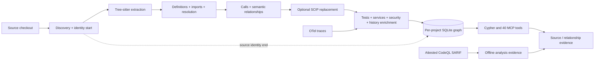

# code-graph

Persistent code knowledge graph and evidence backend for MCP clients.

`code-graph` answers structural questions: what calls a symbol, what it calls,
what implements or overrides it, what may be affected by a change, and what
source or analyzer evidence supports the relationship. Conceptual discovery is
usually better served by
[code-search](https://github.com/redacted-org/code-search).

Originally forked from
[DeusData/codebase-memory-mcp](https://github.com/DeusData/codebase-memory-mcp),
this repository adds security/compliance analysis, service and change-impact
tools, compiler-index ingestion, coherent source identity, relationship
evidence, and bounded cross-project operations.

> **Current state (reviewed 2026-08-13):** implementation baseline
> `4d7d103` (PR #457) is merged on `main`. The latest published release is
> [`v0.8.0-redacted.11`](https://github.com/redacted-org/code-graph/releases/tag/v0.8.0-redacted.11)
> at `45250f8`. PR #457's attested CodeQL importer, assurance-lattice types,
> deterministic PageRank ties, and incremental deletion/re-export equivalence
> fixes are merged source capabilities but are **not in `.11`**. This statement
> does not assert that those source changes are released or live-installed.

Read the [architecture and operating model](docs/ARCHITECTURE.md) for the
indexing pipeline, precision tiers, evidence types, and failure semantics. The
self-contained [HTML guide](docs/index.html) explains `code-search` and
`code-graph` together and can be opened directly in a browser.

## What It Provides

- A local persistent graph built from tree-sitter ASTs for 27 languages.
- A custom read-only Cypher subset, structural search, text search, call traces,
  degree filters, localization, impact analysis, and architecture summaries.
- Relationship enrichment for imports, calls, inheritance, implementation,
  overrides, reads/writes, tests, HTTP links, OPA policy, infrastructure,
  runtime traces, git co-change, and more.
- Full, no-op, and dependency-aware incremental indexing with a background
  watcher and clean-rebuild equivalence coverage.
- Coherent repository/checkout/source/index identity captured across an index
  run and rechecked before evidence is emitted.
- A broad default `heuristic` tier and an optional per-project `scip` precision
  tier with exact artifact binding and coverage/drift reporting.
- Backend-issued symbol, source, relationship, runtime-observation, and
  externally attested analysis references.
- Explicit refusal to present graph reachability as variable-level taint.
- Project-isolated cross-project discovery and index comparison.

## Choose the Right Operation

| Need | Use |
|---|---|
| Find a concept when names are unknown | `code-search` first |
| Find a known symbol or graph node | `search_graph` |
| Exact text, error string, or TODO | `search_code` or `rg` |
| Callers/callees | `trace_call_path` |
| One attributable edge with provenance | `get_relationship_evidence` |
| Arbitrary graph pattern | `query_graph` |
| Change blast radius | `detect_changes` or `get_review_context` |
| Dead code or high-fan-in nodes | `degree_filter` |
| Broad issue localization | `code-search`; graph localization is secondary |
| CALLS/READS/WRITES/USAGE connectivity | `trace_data_flow` |
| Variable-level source-to-sink taint | CodeQL, then the offline `import-codeql` boundary |
| Discovery across local indexes | `localize_across_projects`, then project-bound evidence |

## How It Works



### Indexing

`index_repository` resolves and guards the repository path, captures source
identity, and runs the graph pipeline under a per-project index lock. A full
run builds structure, definitions, imports, calls, usage and semantic edges in
an in-memory buffer, flushes to SQLite, then runs the enrichment passes that
need indexed graph access. Post-flush stages include optional SCIP ingestion,
test links, Louvain communities, HTTP/config/environment links, git history,
security and OPA tags, Zenoh/Nix relationships, lockfile dependencies,
rationale extraction, embeddings, and optional similarity edges.

The implementation reports full/no-op/incremental source deltas. Incremental
runs remove deleted-file state and rebuild affected callers/importers rather
than only reparsing the changed file. A periodic full-reindex sentinel bounds
staleness from dependency shapes the incremental heuristic may not discover.

After graph and optional orientation-report writes finish, the ending source
identity must equal the starting identity. Otherwise the index is marked
incoherent and evidence-capable reads fail closed. By default indexing writes
`ARCHITECTURE_REPORT.md` into the source repository; pass `skip_report=true`
for a read-only checkout or when that generated file is not wanted. The choice
is sticky per project.

Each project has its own SQLite database under
`~/.cache/codebase-memory-mcp/`. The normal steady-state store uses WAL mode;
the router holds a live reference across long indexing operations so an idle
evictor cannot close the database mid-run.

### Language Surface

The current registry contains 27 languages:

Python, JavaScript, TypeScript, TSX, Go, Rust, Java, C, C++, CUDA, Bash,
PowerShell, Nix, HTML, CSS, SCSS, YAML, TOML, HCL, SQL, Dockerfile, JSON, XML,
Markdown, Makefile, CMake, and Protobuf.

Tree-sitter supplies syntax. Relationship resolution quality varies by
language and edge shape; parser support is not a compiler-precision guarantee.

### Query Layer

The custom Cypher engine supports a read-only subset including `MATCH`,
`WHERE`, `RETURN`, `DISTINCT`, ordering, limits, counts, regex/string
predicates, null predicates, and bounded variable-length paths. Write keywords
are rejected by the parser. Responses expose an effective row cap and whether
the result was truncated.

Most common tasks have dedicated tools because they can provide safer schemas,
better performance, and operational metadata than a free-form Cypher query.
The current source exports 40 registered tool definitions.

## Precision Tiers

### Heuristic (Default)

The default graph combines tree-sitter extraction with import-aware and
type-informed static resolution. It is broad, fast, and useful, but it is not
compiler-grade. Reflection, dependency injection, virtual dispatch, external
code, generated code, and higher-order calls can be missing or ambiguous.

Every consequential result should be treated as evidence to verify, not as a
documentation claim merely because an edge exists. Prefer high-confidence
edges, inspect the exact source, and search for counterexamples.

### SCIP (Optional Per Project)

```json
{
  "repo_path": "/absolute/repository",
  "precision_tier": "scip",
  "scip_index_path": "index.scip",
  "skip_report": true
}
```

The preference persists. `index_repository` and `index_status` report the
requested and effective tier, SCIP digest, covered documents/functions,
drifted documents, replaced heuristic edges, and inserted compiler-resolved
calls.

SCIP is a partial precision layer, not a project-wide certification. Only
covered, non-drifted documents receive SCIP-derived call replacement.
Uncovered files remain heuristic. If the requested artifact is missing or
invalid, the effective tier stays heuristic and status is visibly degraded.

`get_relationship_evidence` binds the exact SCIP SHA-256 into each derived
`relationship_ref`. A downstream evaluator may count that individual edge as
compiler-resolved only when its `resolution_source` includes `scip-ingest` and
the artifact digest is present.

## Verifiable Evidence

The current source defines a shared canonical schema with `code-search`:

| Reference | Binds |
|---|---|
| `symbol_ref` | Repository, revision, path, kind, qualified name, source range |
| `evidence_ref` | Symbol/source/relationship/analysis evidence in one index generation |
| `observation_ref` | Engine, derivation, stance, and confidence over evidence |
| `relationship_ref` | Edge type, both symbols, resolver, confidence, runtime observations, optional compiler artifact |
| `analysis_ref` | Attested CodeQL database/query/SARIF identities and exact path steps |
| `claim_ref` | Stable repository-scoped claim identity |

### User-Facing Evidence Surfaces

- `search_graph` emits `symbol_ref`, `evidence_ref`, and `observation_ref`
  when its live checkout and persisted index identity agree.
- `get_relationship_evidence` emits source/target identities, resolver
  provenance, confidence band, runtime observation count, and immutable
  relationship/evidence/observation references.
- `trace_data_flow(required_assurance="variable_level_taint")` does not return
  a graph path under a taint label. It returns a structured CodeQL handoff.
- `codebase-memory-mcp import-codeql` converts one already-produced, attested
  SARIF 2.1.0 path run into immutable `analysis_ref` evidence. It launches no
  analyzer and writes no graph state. See
  [`docs/codeql-evidence-import.md`](docs/codeql-evidence-import.md).

### Assurance Lattice

`internal/evidence/proof.go` contains a deterministic evaluator for evidence
bundles. It can require capabilities such as source coordinates, semantic or
lexical retrieval, structural relationships, compiler resolution, runtime
observation, or variable-level taint; it also represents contradiction search,
coverage, invariants, blockers, and caveats.

As of the reviewed baseline, that evaluator is an internal Go contract and test
surface, **not a registered MCP tool**. The user-facing product surfaces are
the evidence-producing tools and offline importer above. A client or future
host may assemble and evaluate proof bundles without changing the stable IDs.

## Quick Start

This is an internal package in a private repository. It is not published to the public MCP Registry,
which cannot distribute private packages. Installation therefore requires an
authenticated GitHub CLI session with repository access.
Release archives are checksum-verified, matched to the immutable release, and
checked for GitHub build provenance before installation.

### Install a Release

Choose the archive for your platform from the
[`v0.8.0-redacted.11` release](https://github.com/redacted-org/code-graph/releases/tag/v0.8.0-redacted.11):

```bash
REPO="redacted-org/code-graph"
TAG="v0.8.0-redacted.11"
ASSET="codebase-memory-mcp-darwin-arm64.tar.gz"  # choose your platform

gh release download "$TAG" --repo "$REPO" --pattern "$ASSET" --pattern checksums.txt
shasum -a 256 -c checksums.txt --ignore-missing
gh attestation verify "$ASSET" --repo "$REPO"

tar -xzf "$ASSET"
install -m 0755 codebase-memory-mcp "$HOME/.local/bin/codebase-memory-mcp"
codebase-memory-mcp --version
codebase-memory-mcp install
```

The binary is self-contained apart from the platform runtime. Graph indexing
needs no database service or API key. Semantic graph search and the LLM-driven
localizer require their configured external model keys.

### Index, Verify, and Query

```text
index_repository(repo_path="/absolute/repository", skip_report=true)
index_status(project="<project-name>")
search_graph(project="<project-name>", label="Function", name_pattern="auth")
trace_call_path(project="<project-name>", function_name="authenticate", direction="inbound", depth=2)
get_relationship_evidence(project="<project-name>", qualified_name="module.authenticate", direction="inbound")
```

Use `list_projects` to obtain canonical project names. Require a captured,
live-matching index identity before relying on emitted evidence.

The same operations are available from the CLI:

```bash
codebase-memory-mcp cli index_repository \
  '{"repo_path":"/absolute/repository","skip_report":true}'
codebase-memory-mcp cli --raw list_projects | jq .
```

## MCP Tools

### Index and Project State

| Tool | Purpose |
|---|---|
| `index_repository` | Full/no-op/incremental index with identity and precision-tier reporting |
| `index_status` | Read project, identity, freshness, precision, and enrichment state |
| `index_health` | Coverage, parse, stale-file, and unsupported-extension diagnostics |
| `list_projects` | List isolated project databases |
| `delete_project` | Destructively remove one project graph |
| `compare_project_indexes` | Deterministic file/declaration delta between two indexes |
| `localize_across_projects` | Project-balanced graph discovery across up to 25 indexes |
| `ingest_traces` | Apply OpenTelemetry observations to HTTP relationships |

### Search, Query, and Evidence

| Tool | Purpose |
|---|---|
| `search_graph` | Filter graph nodes by label, name, path, degree, and properties |
| `search_code` | Grep-like source text search inside an indexed project |
| `search_code_semantic` | Voyage-backed graph-node semantic search |
| `query_graph` | Execute the read-only Cypher subset |
| `get_code_snippet` | Resolve a symbol and read its source |
| `get_graph_schema` | Node/edge counts and relationship patterns |
| `get_architecture` | Packages, entry points, routes, services, clusters, and hotspots |
| `get_relationship_evidence` | Edge-level resolver/runtime/compiler provenance and immutable refs |

### Tracing and Context

| Tool | Purpose |
|---|---|
| `trace_call_path` | Inbound/outbound call-like BFS with confidence filtering |
| `trace_data_flow` | CALLS/READS/WRITES/USAGE reachability or CodeQL handoff |
| `detect_changes` | Git diff to affected symbols and graph blast radius |
| `get_affected_tests` | Tests related to changed or selected code |
| `get_relevant_context` | Graph-only callers, callees, tests, and co-change context |
| `get_review_context` | Token-bounded review summary over detected changes |

### Localization and Ranking

| Tool | Purpose |
|---|---|
| `rank_by_query` | Query-seeded weighted PageRank |
| `code_localize` | Deterministic graph-guided localization |
| `code_localize_agent` | LLM-driven multi-turn graph localization |
| `find_similar_functions` | Embedding-nearest graph functions |
| `degree_filter` | Direct degree predicates for dead code, leaves, and hubs |

### Service, Security, and Maintenance

| Tool | Purpose |
|---|---|
| `explain_symbol` | Callers, callees, source, and context for a symbol |
| `explain_service` | Service dependencies, endpoints, and configuration |
| `service_map` | Noise-filtered service relationship map |
| `diff_services` | Structural comparison of two services |
| `query_security_surfaces` | Auth, input, crypto, and sensitive-sink discovery |
| `query_stig_evidence` | Control-to-code evidence discovery |
| `detect_cycles` | Dependency cycle detection |
| `get_change_coupling` | Git-history co-change relationships |
| `diff_graph` | Symbol-level graph delta between Git revisions |
| `find_rationale` | WHY/NOTE/HACK/SAFETY/TODO annotations |
| `generate_report` | Explicitly write an architecture orientation report |
| `manage_adr` | Store, read, update, or delete graph ADR state |
| `visualize` | Generate a self-contained HTML graph neighborhood |

## Recommended Workflow

1. Use `code-search` to discover the smallest candidate set for a conceptual
   question.
2. Read the candidate's backend-issued atomic source evidence.
3. Use `search_graph` to resolve the canonical symbol.
4. Run exactly the relationship query the claim needs; avoid broad graph
   wandering.
5. For a consequential edge, select `get_relationship_evidence` output and
   report the effective precision tier.
6. Search for a contradiction or missing expected edge. An empty result is not
   proof of absence without defined coverage.
7. Escalate to source reading, compiler evidence, runtime traces, or CodeQL when
   the requested assurance exceeds the graph's capability.

Composition is client-owned. `get_relevant_context` uses graph state only; it
does not call `code-search` behind the scenes.

## Measured Evidence

- **Heuristic Go CALLS:** five production subsets against a deterministic
  `go/ast` oracle measured scope-aligned precision `0.953`, recall `1.000`, and
  F1 `0.976`. Raw unscoped precision was `0.540`; do not conflate the two.
- **Compiler-tier Go CALLS:** an independent SSA/RTA oracle over code-graph and
  Cobra measured precision `0.969`, recall `0.932`, and F1 `0.950`. Cobra
  recall was `0.867` and remains a visible gap.
- **Compiler-tier TypeScript CALLS:** a TypeScript compiler-API oracle over a
  pinned Ky revision measured 138 TP, 0 FP, and 0 FN for the scoped static call
  and constructor shapes.
- **Normal-tier TypeScript IMPORTS:** pinned Ky and Chainlit frontend scopes
  measured 456 TP, 0 FP, and 0 FN for the declared static resolution shapes.
- **TypeScript declared relationships:** Ky, Chainlit, and free-style scopes
  measured 13/13 `INHERITS`/`IMPLEMENTS` edges. The small count is explicit;
  it is not a language-wide guarantee.
- **Very large repository:** released `.6` indexed a pinned 39,222,246-line
  LLVM checkout into 729,625 nodes and 2,302,869 edges in 2,198 seconds with
  9.43 GB peak RSS and a 2.89 GB database. Five warm queries measured 9.78
  seconds p50 and 10.50 seconds p95. A later focused localization path reduced
  one fixed query's repeat median to 3.02 seconds and fresh peak RSS to 0.627
  GB without reducing index size.
- **Graph-only conceptual localization:** on frozen public LocBench `n=80`, a
  released seed-quality change improved Acc@1 from `0.175` to `0.200` and
  MRR@10 from `0.219` to `0.260`. This remains a weak operating point; use
  `code-search` for conceptual discovery.
- **Incremental equivalence:** the current main matrix covers modification,
  deletion, TypeScript re-export, call relationships, and no-op lifecycle
  cases against clean rebuilds. See
  [`bench/accuracy/baselines/2026-08-13-incremental-clean-equivalence.md`](bench/accuracy/baselines/2026-08-13-incremental-clean-equivalence.md).

These measurements are bounded by their exact revisions, languages, edge
types, fixtures, and oracles. They do not establish universal compiler
precision or general product superiority.

## Boundaries and Tradeoffs

- The normal graph is heuristic. Compiler accuracy is established only for
  declared measured cells and SCIP-covered non-drifted documents.
- `trace_data_flow` is graph connectivity, not variable-level taint, path
  feasibility, sanitizer modeling, or vulnerability proof.
- Graph-only conceptual localization is materially weaker than semantic
  search.
- The SQLite-per-project architecture works on a very large repository but is
  not a distributed organization indexing fleet.
- Cross-project discovery and comparison have no organization ACL layer or
  globally calibrated score space.
- Sourcegraph has a broader search/history/ACL/operations surface. LSPs provide
  editor-native, compiler-aware navigation. CodeQL is stronger for
  vulnerability-grade data flow.
- Runtime trace ingestion confirms observed HTTP relationships; lack of an
  observation does not prove a relationship cannot occur.
- Generated reports and visualizations are writes. Use `skip_report=true` and
  read-only tools when the source checkout must remain untouched.

## Development

Requires Go 1.26+ and a C compiler for the vendored tree-sitter grammars.

```bash
make build
go test ./... -count=1
golangci-lint run ./...
gofmt -w .
```

Export the exact registered MCP surface without starting a transport:

```bash
go run ./cmd/export-tool-schemas | jq 'length, .[].name'
```

The current export contains 40 tools. Tests, schema export, and source review
verify implementation; any quality or performance claim additionally requires
the relevant current-state measurement and oracle.

## License

MIT (inherited from upstream).
