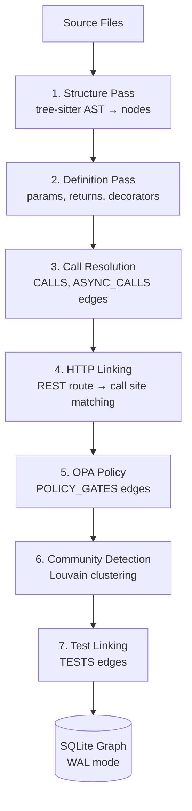

# code-graph

Persistent code knowledge graph MCP server for Claude Code. Structural analysis via tree-sitter AST parsing with a Cypher-like query language.

Originally forked from [DeusData/codebase-memory-mcp](https://github.com/DeusData/codebase-memory-mcp). Substantially extended with security surface analysis, STIG evidence queries, sensitive data flow tracing, cross-service HTTP linking, dead code detection, change coupling from git history, Louvain community clustering, and more.

## Why This Exists

Semantic search (code-search) finds code by *meaning* — ask "where is the auth middleware?" and get ranked results. But it can't answer structural questions: "What calls this function?", "If I change this, what breaks?", "Is this function dead code?"

Those questions require understanding the *structure* of the codebase — the call graph, import chains, type hierarchies, HTTP route bindings, and file co-change patterns. That's what code-graph provides: a persistent knowledge graph built from tree-sitter ASTs that you can query with Cypher.

**The token savings are dramatic.** Answering "what calls `authenticate()`?" with grep/Glob requires reading every file that contains the word "authenticate", then manually tracing which usages are actual function calls vs. comments, strings, or variable names. For a 50K-line repo, that's ~80K tokens of context. A single code-graph query returns the precise answer in ~500 tokens — a **160x reduction**.

The graph persists in SQLite across sessions. Index once, query forever (with automatic incremental re-indexing when files change).

## How It Works

### Multi-Pass Indexing Pipeline

Indexing a repository runs through 7 sequential passes, each building on the previous:




1. **Structure pass**: tree-sitter parses every file into an AST. Extracts packages, files, modules, classes, functions, methods, interfaces, enums, and type definitions as graph nodes. Creates `CONTAINS_*` and `DEFINES` edges for the containment hierarchy.

2. **Definition pass**: Resolves function/method definitions with parameters, return types, and decorators. Go gets enhanced LSP-style type resolution for cross-package calls.

3. **Call resolution pass**: Walks AST call expressions and resolves them to definition nodes using import-aware, type-inferred matching. Creates `CALLS`, `ASYNC_CALLS`, and `USAGE` edges. This is where the call graph is built — the core value of the tool.

4. **HTTP linking pass**: Discovers REST routes (FastAPI `@app.get`, Gin `router.GET`, Express `app.get`) and matches them to call sites that make HTTP requests to those routes. Creates `HTTP_CALLS` edges that connect microservices across repo boundaries.

5. **OPA policy pass**: Links OPA policy files to the code they gate. Creates `POLICY_GATES` edges from policy decisions to enforced endpoints.

6. **Community detection**: Runs Louvain clustering to identify natural module boundaries in the graph. Useful for understanding which parts of the codebase form cohesive units.

7. **Test linking pass**: Identifies test files and creates `TESTS` edges from test functions to the production code they exercise.

### 64 Languages via Tree-Sitter

Every language is parsed using vendored tree-sitter C grammars compiled via CGO. Language specs in `internal/lang/` map tree-sitter node types to graph concepts (which AST nodes become Function nodes, which become Class nodes, etc.).

The full list: Python, Go, JavaScript, TypeScript, TSX, JSX, Rust, Java, C, C++, C#, Kotlin, Scala, Swift, Ruby, PHP, Perl, Lua, Bash, Zig, Dart, R, Elixir, Erlang, Haskell, OCaml, Objective-C, Groovy, and 36 more including config languages (YAML, TOML, HCL, Dockerfile, SQL, CSS, SCSS, HTML).

### Cypher Query Engine

A custom read-only Cypher lexer, parser, planner, and executor allow graph queries like:

```cypher
MATCH (f:Function)-[:CALLS]->(g:Function)
WHERE f.name = 'main'
RETURN g.name, g.file
```

Variable-length path queries are supported for transitive dependency analysis:

```cypher
MATCH (f:Function)-[:CALLS*1..3]->(g:Function)
WHERE f.name = 'handleRequest'
RETURN DISTINCT g.name
```

### Persistence and Auto-Sync

The graph is stored in SQLite (WAL mode) at `~/.cache/codebase-memory-mcp/`. It persists across sessions — index once, and the graph is available every time Claude Code starts.

A background watcher polls for file changes (mtime + size) and triggers incremental re-indexing. Adaptive polling intervals reduce overhead for inactive projects. Content-hash-based change detection ensures only actually modified files get re-indexed.

## Benchmarks

Tested across **35 languages** using 12 standardized questions per language against real open-source repos (78 to 49K nodes):

| Metric | Value |
|--------|------:|
| Languages tested | 35 |
| Total questions | 370 |
| Overall score | **91.8%** |
| Perfect scores (100%) | 17 languages |
| Tier 1 (>=90%) | 17 languages |
| Tier 2 (75-89%) | 16 languages |
| Tier 3 (<75%) | 2 languages (OCaml 72%, Haskell 62%) |

### Highlights

- **Zero indexing failures** across 63 repos of all sizes
- **Handles kernel-scale code**: Linux kernel Intel Ethernet drivers (20K nodes, 67K edges, 129K-char trace output) — no timeouts
- **Django (49K nodes, 196K edges)**, **Laravel (38K nodes, 161K edges)**, **Neovim (24K nodes, 90K edges)** all index and query without performance issues
- **100% on C, C++, Lua, Kotlin, Perl, Groovy, Objective-C, Bash, Zig** and 8 config languages

### Known limitations

- **Function properties** (parameters, return types) are not extracted for most languages — this is the most common deduction (PARTIAL on Q10)
- **Haskell function composition** (`f . g . h`) is not modeled as CALLS edges — only explicit application is traced
- **OCaml module functors** add indirection that limits call resolution
- **Cypher `IS NOT NULL`** is not supported — use alternative query patterns

See [BENCHMARK.md](BENCHMARK.md) for the full per-language breakdown with detailed results for all 35 languages.

## MCP Tools

### Core Search and Query

| Tool | Purpose |
|------|---------|
| `search_graph` | Structured search with filters — find by label, name pattern, file. Case-insensitive by default. |
| `search_code` | Grep-like text search within indexed files |
| `query_graph` | Execute Cypher-like graph queries (read-only) |
| `get_code_snippet` | Read source code for a function by qualified name |
| `get_graph_schema` | Node/edge counts, relationship patterns, sample names |
| `get_architecture` | Codebase orientation — languages, packages, entry points, routes, hotspots, clusters |

### Tracing and Impact Analysis

| Tool | Purpose |
|------|---------|
| `trace_call_path` | BFS call chain traversal with optional risk classification |
| `trace_data_flow` | Track sensitive data paths through function call chains |
| `detect_changes` | Map git diff to affected symbols + blast radius with risk classification |
| `get_relevant_context` | Graph-based file context for LLM agents — callers, callees, tests, change-coupled files in one call |

### Security and Compliance

| Tool | Purpose |
|------|---------|
| `query_security_surfaces` | Find auth boundaries, crypto operations, input validation, sensitive sinks |
| `query_stig_evidence` | Map STIG/SRG controls to code-level implementation evidence |

### Service Understanding

| Tool | Purpose |
|------|---------|
| `explain_service` | Service-level architecture summary — dependencies, endpoints, config |
| `service_map` | Cross-service dependency map with noise filtering |
| `diff_services` | Compare two services structurally |
| `explain_symbol` | What a symbol does — callers, callees, context |

### Quality and Maintenance

| Tool | Purpose |
|------|---------|
| `get_affected_tests` | Find tests impacted by a code change |
| `detect_cycles` | Circular dependency detection with noise filtering |
| `get_change_coupling` | Files that historically co-change (from git history) |
| `get_review_context` | PR review context — what a change touches and what depends on it |

### Index Management

| Tool | Purpose |
|------|---------|
| `index_repository` | Index a repo into the graph (incremental, content-hash based) |
| `index_status` | Index stats and status for a project |
| `index_health` | Graph coverage report — parse failures, missing edges, stale files |
| `list_projects` | Show all indexed projects with node/edge counts |
| `delete_project` | Remove a project and all its graph data |
| `manage_adr` | CRUD for Architecture Decision Records |
| `ingest_traces` | Import OpenTelemetry traces for HTTP_CALLS validation |
| `visualize` | HTML graph visualization of node neighborhoods |

## Examples

### Cypher query — what does `main` call?

```cypher
MATCH (f:Function)-[:CALLS]->(g:Function)
WHERE f.name = 'main'
RETURN f.name, g.name, g.file
LIMIT 5
```

**Actual output** (from code-graph's own codebase):
```
f.name  | g.name            | g.file
--------|-------------------|-------
main    | printTopLevelHelp  |
main    | runInstall         |
main    | runUninstall       |
main    | runUpdate          |
main    | runConfig          |
```

One query, 5 rows, ~200 tokens. The equivalent grep would search every file for "main" and return thousands of matches including comments, string literals, and variable names.

### Call trace — who calls `_auth_headers`?

```
trace_call_path(function_name="_auth_headers", direction="inbound", depth=2)
```

**Actual output** (from mcp-servers repo, 2,725 nodes):
```
_auth_headers (msgraph/msgraph_mcp.py)
├── hop 1 (direct callers):
│   ├── _graph_get
│   ├── _graph_post
│   ├── _graph_patch
│   ├── _graph_delete
│   └── _graph_get_all
└── hop 2 (callers of callers):
    ├── graph_request        ← the generic MCP tool handler
    ├── graph_mutate         ← the write MCP tool handler
    ├── list_users           ← 93 specific MCP tools that
    ├── get_user               call through _graph_get/post
    ├── list_groups
    ├── list_sign_ins
    ├── list_audit_logs
    └── ... (90+ more functions)
```

This reveals the full dependency tree: `_auth_headers` is called by 5 HTTP helpers, which are called by 93 MCP tool functions. Changing `_auth_headers` has a blast radius of 98 functions — information that's invisible to grep.

### Architecture overview

```
get_architecture(project="mcp-servers")
```

**Actual output:**
```
Project: mcp-servers
Nodes: 2,725 | Edges: 4,230

Node types:
  Function: 1,316    Method: 90
  Section:  523       Class:  34
  Variable: 469       File:   113

Edge types:
  CALLS:          2,443    DEFINES:       1,315
  USAGE:            167    DEFINES_METHOD:   90
  TESTS:             34    IMPORTS:           5
```

In one call: the shape of the entire codebase. 1,316 functions, 2,443 call edges, 34 test edges. An AI agent now knows this is a function-heavy Python repo with minimal class hierarchy.

### Search the graph — find functions matching a pattern

```
search_graph(label="Function", name_pattern="auth", include_connected=true, limit=3)
```

**Actual output:**
```json
[
  {"name": "_auth_headers", "file": "msgraph/msgraph_mcp.py", "in_degree": 5, "out_degree": 1},
  {"name": "_auth_headers", "file": "workspace-provisioner/clients/graph.py", "in_degree": 3, "out_degree": 1},
  {"name": "_build_oauth", "file": "shared/mcp_http.py", "in_degree": 2, "out_degree": 2}
]
```

Structural search: finds functions by name pattern and immediately shows their connectivity (in_degree = callers, out_degree = callees). High in_degree = widely used. High out_degree = complex function.

## Examples

### Cypher query — what does `main` call?

```cypher
MATCH (f:Function)-[:CALLS]->(g:Function)
WHERE f.name = 'main'
RETURN f.name, g.name, g.file
LIMIT 5
```

**Actual output** (from code-graph's own codebase):
```
f.name  | g.name            | g.file
--------|-------------------|-------
main    | printTopLevelHelp  |
main    | runInstall         |
main    | runUninstall       |
main    | runUpdate          |
main    | runConfig          |
```

One query, 5 rows, ~200 tokens. The equivalent grep would search every file for "main" and return thousands of matches including comments, string literals, and variable names.

### Call trace — who calls `_auth_headers`?

```
trace_call_path(function_name="_auth_headers", direction="inbound", depth=2)
```

**Actual output** (from mcp-servers repo, 2,725 nodes):
```
_auth_headers (msgraph/msgraph_mcp.py)
├── hop 1 (direct callers):
│   ├── _graph_get
│   ├── _graph_post
│   ├── _graph_patch
│   ├── _graph_delete
│   └── _graph_get_all
└── hop 2 (callers of callers):
    ├── graph_request        ← the generic MCP tool handler
    ├── graph_mutate         ← the write MCP tool handler
    ├── list_users           ← 93 specific MCP tools that
    ├── get_user               call through _graph_get/post
    ├── list_groups
    ├── list_sign_ins
    ├── list_audit_logs
    └── ... (90+ more functions)
```

This reveals the full dependency tree: `_auth_headers` is called by 5 HTTP helpers, which are called by 93 MCP tool functions. Changing `_auth_headers` has a blast radius of 98 functions — information that's invisible to grep.

### Architecture overview

```
get_architecture(project="mcp-servers")
```

**Actual output:**
```
Project: mcp-servers
Nodes: 2,725 | Edges: 4,230

Node types:
  Function: 1,316    Method: 90
  Section:  523       Class:  34
  Variable: 469       File:   113

Edge types:
  CALLS:          2,443    DEFINES:       1,315
  USAGE:            167    DEFINES_METHOD:   90
  TESTS:             34    IMPORTS:           5
```

In one call: the shape of the entire codebase. 1,316 functions, 2,443 call edges, 34 test edges. An AI agent now knows this is a function-heavy Python repo with minimal class hierarchy.

### Search the graph — find functions matching a pattern

```
search_graph(label="Function", name_pattern="auth", include_connected=true, limit=3)
```

**Actual output:**
```json
[
  {"name": "_auth_headers", "file": "msgraph/msgraph_mcp.py", "in_degree": 5, "out_degree": 1},
  {"name": "_auth_headers", "file": "workspace-provisioner/clients/graph.py", "in_degree": 3, "out_degree": 1},
  {"name": "_build_oauth", "file": "shared/mcp_http.py", "in_degree": 2, "out_degree": 2}
]
```

Structural search: finds functions by name pattern and immediately shows their connectivity (in_degree = callers, out_degree = callees). High in_degree = widely used. High out_degree = complex function.

## What It's Good For

- **"What calls this?"** — Trace inbound callers to any function, across files and packages
- **"What does this call?"** — Trace outbound callees to understand execution flow
- **"What breaks if I change this?"** — `detect_changes` maps git diffs to affected symbols with blast radius
- **"Is this dead code?"** — Functions with zero callers (excluding entry points and framework-decorated functions)
- **"How do these microservices connect?"** — HTTP route linking discovers REST API call patterns across services
- **"What tests cover this?"** — `get_affected_tests` finds tests impacted by a change
- **"What files need to change together?"** — `get_change_coupling` mines git history for co-change patterns
- **Security surface analysis** — Find auth boundaries, crypto operations, input entry points, sensitive sinks
- **STIG compliance mapping** — `query_stig_evidence` connects security controls to code-level evidence

## What It's Not Good For

- **Finding code by meaning** — "Where is the auth middleware?" is a semantic question. Use [code-search](https://github.com/redacted-org/code-search) for natural language queries.
- **Dynamic dispatch / runtime polymorphism** — The graph is built from static AST analysis. Virtual method calls, reflection, and dependency injection are not fully resolved.
- **Haskell/OCaml functional composition** — Point-free style (`f . g . h`) doesn't generate CALLS edges.
- **Very large monorepos (>100K files)** — Indexing works but can take 10+ minutes. Scope to subdirectories for faster iteration.
- **Build system analysis** — Makefiles, CMake, Bazel build graphs are not modeled.

## How code-search and code-graph Work Together

These tools are complementary — **code-search finds by meaning, code-graph finds by structure**.

| Question | Tool |
|----------|------|
| "Where is the auth middleware?" | **code-search** — semantic, meaning-based |
| "What calls `authenticate()`?" | **code-graph** — structural, call graph |
| "Find rate limiting code" | **code-search** — conceptual search |
| "Blast radius of changing `User.validate()`?" | **code-graph** — dependency + change coupling |
| "How does error handling work?" | Both — code-search finds patterns, code-graph traces flows |

The `get_relevant_context` tool bridges both: given files you plan to modify, it returns callers, callees, tests, and change-coupled files — everything an AI agent needs to make a safe change, in ~500 tokens instead of ~80K.

## Troubleshooting

| Problem | Cause | Fix |
|---------|-------|-----|
| **"function not found"** on trace | Function name doesn't match exactly (case-sensitive) | Use `search_graph(name_pattern="auth")` first to find the exact name |
| **Empty Cypher results** | Wrong project or missing `project` parameter | Add `project` parameter. Run `list_projects` to see available names. |
| **0 CALLS edges** for a function | Abstract method, built-in, or external dependency call | Expected — code-graph traces static AST calls, not dynamic dispatch. Use `search_graph(include_connected=true)` for alternative connectivity info. |
| **Indexing hangs on large repo** | Large repo (>50K files) takes time | Scope to subdirectory. `index_repository(path="/repo/src")` instead of `/repo`. |
| **Stale graph after code changes** | Auto-sync interval hasn't triggered yet | Background watcher polls at adaptive intervals. Force refresh: `index_repository` with same path. |
| **"Cypher IS NOT NULL not supported"** | Parser limitation | Use alternative: `MATCH (f:Function) WHERE f.params <> '' RETURN f.name` or filter client-side. |
| **200-row cap on query results** | Default `max_rows` limit | Add `max_rows: 1000` parameter to `query_graph`. Aggregations (COUNT) may undercount at default cap. |

## Comparison to Alternatives

| Tool | Strengths | Limitations | When to use instead of code-graph |
|------|-----------|-------------|-----------------------------------|
| **LSP (gopls, rust-analyzer, Pyright)** | Real-time, type-aware, handles dynamic dispatch | Single-language, requires editor, no cross-repo | Real-time navigation within a single language in your IDE. |
| **ctags / Universal Ctags** | Fast symbol indexing, multi-language | No call graph, no structural queries, just definitions | Quick symbol lookup when you need "where is X defined?" |
| **Sourcetrail** (discontinued) | Beautiful interactive graph visualization | No longer maintained (archived 2021), no CLI/MCP integration | Historical reference only — code-graph fills this gap. |
| **CodeQL** | Deep interprocedural taint analysis, security-focused | Requires database build (minutes), query language learning curve | Security vulnerability hunting with data flow analysis. |
| **code-search** | Semantic/meaning-based search, handles "find auth code" | No structural understanding — can't trace calls or detect dead code | "Where is the auth code?" not "What calls the auth code?" |
| **grep / ripgrep** | Instant text search, regex, no indexing | No understanding of code structure — "main" matches everything | You know the exact string and need instant results. |

**code-graph is best when**: You need to understand code *structure* — call chains, dependencies, blast radius, dead code, test coverage. It's designed for questions about *relationships* between code, not finding code by content.

## Troubleshooting

| Problem | Cause | Fix |
|---------|-------|-----|
| **"function not found"** on trace | Function name doesn't match exactly (case-sensitive) | Use `search_graph(name_pattern="auth")` first to find the exact name |
| **Empty Cypher results** | Wrong project or missing `project` parameter | Add `project` parameter. Run `list_projects` to see available names. |
| **0 CALLS edges** for a function | Abstract method, built-in, or external dependency call | Expected — code-graph traces static AST calls, not dynamic dispatch. Use `search_graph(include_connected=true)` for alternative connectivity info. |
| **Indexing hangs on large repo** | Large repo (>50K files) takes time | Scope to subdirectory. `index_repository(path="/repo/src")` instead of `/repo`. |
| **Stale graph after code changes** | Auto-sync interval hasn't triggered yet | Background watcher polls at adaptive intervals. Force refresh: `index_repository` with same path. |
| **"Cypher IS NOT NULL not supported"** | Parser limitation | Use alternative: `MATCH (f:Function) WHERE f.params <> '' RETURN f.name` or filter client-side. |
| **200-row cap on query results** | Default `max_rows` limit | Add `max_rows: 1000` parameter to `query_graph`. Aggregations (COUNT) may undercount at default cap. |

## Comparison to Alternatives

| Tool | Strengths | Limitations | When to use instead of code-graph |
|------|-----------|-------------|-----------------------------------|
| **LSP (gopls, rust-analyzer, Pyright)** | Real-time, type-aware, handles dynamic dispatch | Single-language, requires editor, no cross-repo | Real-time navigation within a single language in your IDE. |
| **ctags / Universal Ctags** | Fast symbol indexing, multi-language | No call graph, no structural queries, just definitions | Quick symbol lookup when you need "where is X defined?" |
| **Sourcetrail** (discontinued) | Beautiful interactive graph visualization | No longer maintained (archived 2021), no CLI/MCP integration | Historical reference only — code-graph fills this gap. |
| **CodeQL** | Deep interprocedural taint analysis, security-focused | Requires database build (minutes), query language learning curve | Security vulnerability hunting with data flow analysis. |
| **code-search** | Semantic/meaning-based search, handles "find auth code" | No structural understanding — can't trace calls or detect dead code | "Where is the auth code?" not "What calls the auth code?" |
| **grep / ripgrep** | Instant text search, regex, no indexing | No understanding of code structure — "main" matches everything | You know the exact string and need instant results. |

**code-graph is best when**: You need to understand code *structure* — call chains, dependencies, blast radius, dead code, test coverage. It's designed for questions about *relationships* between code, not finding code by content.

## Setup

Pre-built binary at `~/bin/codebase-memory-mcp.exe`. MCP server name: `code-graph`.

```json
{
  "mcpServers": {
    "code-graph": {
      "type": "stdio",
      "command": "C:/Users/YourUser/bin/codebase-memory-mcp.exe"
    }
  }
}
```

No API keys, no Docker, no external databases. Single binary, zero infrastructure.

Releases are built via `workflow_dispatch` on `release.yml`. Download from [redacted releases](https://github.com/redacted-org/code-graph/releases).

## Graph Data Model

**Node labels**: `Project`, `Package`, `Folder`, `File`, `Module`, `Class`, `Function`, `Method`, `Interface`, `Enum`, `Type`, `Route`, `EnvVar`

**Edge types**: `CONTAINS_PACKAGE`, `CONTAINS_FOLDER`, `CONTAINS_FILE`, `DEFINES`, `DEFINES_METHOD`, `IMPORTS`, `CALLS`, `HTTP_CALLS`, `ASYNC_CALLS`, `IMPLEMENTS`, `HANDLES`, `USAGE`, `CONFIGURES`, `WRITES`, `MEMBER_OF`, `TESTS`, `USES_TYPE`, `FILE_CHANGES_WITH`, `POLICY_GATES`, `READS_ENV`

**Security properties**: Nodes tagged with `security_role` (auth_boundary, input_entry_point, sensitive_sink, crypto_operation, privilege_escalation, session_management, audit_logging) and `security_subtype` (http_handler, cli_entry, sql_query, shell_exec, file_write, encryption, hashing, signing, etc.)

## Architecture

```
cmd/codebase-memory-mcp/       Entry point (MCP stdio server + CLI mode + install/update)
  assets/skills/               4 task-specific skills (exploring, tracing, quality, reference)
internal/
  store/                       SQLite graph storage (WAL mode, Louvain clustering)
  lang/                        Language specs (64 languages, tree-sitter node types)
  cbm/                         Vendored tree-sitter C grammars, AST extraction, Go LSP hybrid
  pipeline/                    Multi-pass indexing (structure -> definitions -> calls -> HTTP -> OPA -> communities)
  httplink/                    Cross-service HTTP route/call-site matching
  cypher/                      Cypher query lexer, parser, planner, executor
  tools/                       MCP tool handlers + CLI dispatch
  watcher/                     Background auto-sync (mtime+size polling, adaptive intervals)
  discover/                    File discovery with .gitignore, .cbmignore, symlink handling
  fqn/                         Qualified name computation
  traces/                      OpenTelemetry trace ingestion
  selfupdate/                  GitHub release checking + binary swap
```

## Development

```bash
# Build (requires Go 1.26+ and a C compiler for tree-sitter CGO)
CGO_ENABLED=1 go build -o bin/codebase-memory-mcp.exe ./cmd/codebase-memory-mcp/

# Test
go test ./... -count=1

# Lint (golangci-lint v2.10)
golangci-lint run ./...

# Format
gofmt -w .
```

Windows: Install [MSYS2](https://www.msys2.org/), then `pacman -S mingw-w64-ucrt-x86_64-gcc`. Build from UCRT64 shell.

## Testing

Key test suites:

| Test | File | Purpose |
|------|------|---------|
| Language parity | `internal/pipeline/langparity_test.go` | 125+ cases verifying AST extraction across languages |
| AST structure | `internal/pipeline/astdump_test.go` | 90+ cases verifying tree-sitter node type mapping |
| Integration | `internal/pipeline/pipeline_test.go` | End-to-end indexing pipeline |
| Cypher engine | `internal/cypher/cypher_test.go` | Query parsing and execution |
| HTTP linking | `internal/httplink/httplink_test.go` | Cross-service route matching |

The language benchmark (`BENCHMARK.md`) tests 12 standardized questions across 35 languages on real open-source repos — not synthetic test data.

## Related Work

This project sits in the tree-sitter-based code-graph + LLM retrieval space. Relevant academic and production work:

- **Codebase-Memory**: [Tree-Sitter-Based Knowledge Graphs for LLM Code Exploration](https://arxiv.org/abs/2603.27277) — the upstream paper documenting the architecture this fork extends. Authoritative literature anchor for the approach (tree-sitter + SQLite WAL + Cypher subset + MCP).
- **LocAgent** (ACL 2025): [Graph-Guided LLM Agents for Code Localization](https://arxiv.org/abs/2503.09089) — heterogeneous graph + multi-hop reasoning achieves 92.7% file-level localization accuracy; Loc-Bench is a public benchmark for this class of tools.
- **Prometheus** (ICLR 2026 submission): [Unified Knowledge Graphs for Issue Resolution in Multilingual Codebases](https://openreview.net/forum?id=bPGZi7X5vH) — closest academic match for the multilingual-KG-feeding-docs-pipeline use case.
- **Code Graph Model / CGM** (NeurIPS 2025): [A Graph-Integrated Large Language Model for Repository-Level Software Engineering Tasks](https://arxiv.org/abs/2505.16901) — integrates graph structure directly into LLM attention (44% on SWE-Bench-Lite with open-weight Qwen2.5-72B). Relevant for downstream docs-pipeline consumers of graph output.
- **LogicLoc**: [Neurosymbolic Repo-level Code Localization](https://arxiv.org/abs/2604.16021) — Datalog + LLM hybrid with soundness guarantees; validates the direction of richer structured-query support in our Cypher engine (e.g., `OPTIONAL MATCH`).
- **GraphCodeAgent**: [Dual Graph-Guided LLM Agent for Retrieval-Augmented Repo-Level Code Generation](https://arxiv.org/abs/2504.10046) — adds semantic-similarity edges as first-class graph structure alongside call/import/inheritance edges.
- **Aider** repo-map: [Building a better repository map with tree sitter](https://aider.chat/2023/10/22/repomap.html) — tree-sitter tags + PageRank ranking over code graph as agent-context primitive.

For ground-truth methodology (multi-annotator hand-oracles with Cohen's Kappa):

- **CLEVER** (NeurIPS 2025): [A Curated Benchmark for Formally Verified Code Generation](https://arxiv.org/abs/2505.13938) — published cost data for hand-curation (~25 min/problem spec + 15 min review).
- **Code Debloating ground-truth**: [Revisiting Code Debloating with Ground Truth-based Evaluation](https://arxiv.org/abs/2604.17717) — two-annotator methodology with Cohen's Kappa >0.81 as the agreement standard.

## License

MIT (inherited from upstream)
