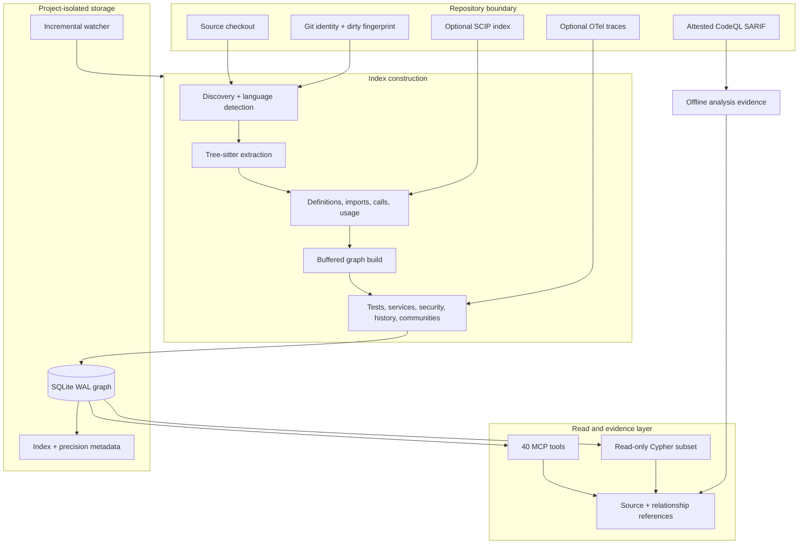

# code-graph Architecture and Operating Model

This document describes how `code-graph` builds, stores, and queries structural
code intelligence; how it binds results to source; and where heuristic graph
evidence must give way to compiler, runtime, or security-analyzer evidence.

## State of Record

| Dimension | State reviewed 2026-08-13 |
|---|---|
| Implementation baseline | `main` of `brandyn-s/code-graph` (public primary since 2026-09) |
| Latest published release | none yet from this repository; `v0.9.0` is the first public release. Earlier `v0.8.0-redacted.N` builds were internal. |
| Merged since the last internal build | CodeQL evidence import, assurance types, deterministic PageRank ties, incremental equivalence fixes, public rename and installer |
| Runtime assertion | None; inspect the installed MCP process separately |
| Registered MCP surface | 40 tools |
| Parser registry | 27 languages |

Source, release, and runtime are different states. This document describes the
reviewed source baseline. A capability listed as merged after `.11` is not a
claim that any installed server contains it.

## Design Intent

`code-graph` is the relationship half of the verifiable code-intelligence
stack. It is designed around five properties:

1. **Persistent structure.** Parse once and reuse a project graph across many
   structural questions.
2. **Bounded precision.** Make heuristic, compiler-derived, runtime-observed,
   and externally analyzed evidence distinguishable.
3. **Coherent identity.** Bind graph reads to the repository, checkout, source
   revision, dirty state, and index generation that produced them.
4. **Attributable relationships.** Give consequential edges resolver,
   confidence, coverage, and immutable evidence identities.
5. **Fail-closed assurance.** Do not relabel graph reachability as taint or an
   incomplete compiler tier as project-wide certainty.

It is not a distributed Sourcegraph replacement, an LSP, a live runtime
profiler, or a variable-level security analyzer.

## Component Model



## Index Construction

### 1. Project Resolution and Locking

`index_repository` accepts an absolute repository path, applies path guards,
derives a project identity, opens that project's store, and serializes index
writes under a project lock. Project databases live beneath
`~/.cache/code-graph/`; one project's graph is never merged silently
into another's.

The router keeps an active database reference throughout indexing so idle
eviction cannot close the handle during a long build.

### 2. Source Identity Fence

Before graph construction, the indexer captures repository and checkout
identity, Git revision, source-manifest state, and dirty information. It
captures them again after every index-related write, including the optional
orientation report.

If the ending identity differs, the run is marked incoherent. Evidence-capable
reads require a persisted index identity that still matches the live checkout.
This prevents an edge from being presented as current after the source moved
under the indexer.

Indexing writes `ARCHITECTURE_REPORT.md` by default. Set `skip_report=true` for
a read-only checkout or when generated documentation is not wanted. The
preference persists for that project.

### 3. Discovery and Parsing

The current parser registry contains 27 languages:

Python, JavaScript, TypeScript, TSX, Go, Rust, Java, C, C++, CUDA, Bash,
PowerShell, Nix, HTML, CSS, SCSS, YAML, TOML, HCL, SQL, Dockerfile, JSON, XML,
Markdown, Makefile, CMake, and Protobuf.

Tree-sitter provides a broad, consistent syntax layer. Language adapters turn
captures into files, packages, declarations, imports, calls, fields, usages,
endpoints, configuration, and other graph records. Parser coverage means the
syntax can be indexed; it does not mean every semantic relationship is
compiler-resolved.

### 4. Resolution and Enrichment

The build is intentionally multi-stage rather than one fixed seven-pass
pipeline. Early stages create structure and definitions; later stages depend
on those records to resolve calls, imports, inheritance, implementation,
overrides, reads/writes, and semantic links.

After the buffered core graph is flushed, database-backed enrichers add the
relationships their analyses require. The enabled stages include tests,
Louvain communities, HTTP/config/environment links, service relationships,
git co-change, rationale comments, security and OPA tags, Zenoh/Nix links,
lockfile dependencies, embeddings, and optional similarity edges.

OpenTelemetry ingestion adds observed HTTP relationships. An observed edge is
positive runtime evidence; an unobserved edge is not proof that a path cannot
occur.

### 5. Full, No-op, and Incremental Paths

The indexer classifies a run as full, no-op, or incremental. Incremental work
uses source hashes and dependency state to remove deleted-file graph records,
reparse changed files, and invalidate affected callers and importers. This is
stronger than reparsing only the modified file.

A periodic full-reindex sentinel bounds drift from dependency shapes the
incremental heuristic may miss. The equivalence suite compares incremental
results with a clean rebuild across modification, deletion, call, and
TypeScript re-export cases. Equivalence is a tested contract for those cells,
not a proof for every language and relationship.

### 6. Storage and Watcher

The normal store is SQLite in WAL mode. Nodes, relationships, properties,
source ranges, index metadata, precision state, trace observations, and
supporting features share the project database.

The background watcher polls source metadata and hashes, detects deletion-only
changes, and schedules an incremental update. Status tools expose indexing,
freshness, health, unsupported extensions, and requested/effective precision.

## Graph Model and Query Layer

Common node shapes include repository, file, package/module, type, function,
method, variable/field, endpoint, service, test, policy, configuration, and
rationale records. Common edges include containment, definition, import,
calls, inheritance, implementation, override, usage, reads, writes, test,
HTTP/service, policy, dependency, similarity, and co-change relationships.

The custom Cypher engine implements a read-only subset with `MATCH`, `WHERE`,
`RETURN`, `DISTINCT`, ordering, limits, aggregate counts, string/regex/null
predicates, and bounded variable-length paths. Write keywords are rejected.
Responses report the effective row cap and truncation state.

Dedicated tools are preferred for ordinary tasks because they can enforce
bounded traversal, typed inputs, consistent limits, and richer provenance.
Use free-form `query_graph` only when a dedicated operation cannot express the
relationship.

## Precision Tiers

### Heuristic Tier

The default tier combines tree-sitter facts with import-aware and type-informed
static resolution. It has broad language coverage and is useful for navigation,
impact hypotheses, architecture inspection, and candidate generation.

It is not compiler-grade. Reflection, virtual dispatch, dependency injection,
generated code, higher-order calls, external dependencies, and ambiguous names
can produce missing or uncertain edges. Confidence is evidence metadata, not a
substitute for checking the source.

### SCIP Tier

`precision_tier="scip"` and `scip_index_path` request a per-project compiler
index. The artifact is parsed and bound by digest. Only covered,
non-drifted documents receive SCIP-derived CALLS replacement; uncovered files
remain heuristic.

Status reports the requested and effective tier, digest, coverage, drift,
replaced heuristic edges, and inserted compiler-resolved calls. A missing or
invalid artifact degrades visibly to the heuristic tier. It never upgrades the
whole project merely because one SCIP file was supplied.

### Runtime and Analyzer Evidence

Runtime observations enrich individual relationships. They do not replace the
static graph or establish completeness.

For variable-level source-to-sink reasoning, use CodeQL or another purpose-built
analyzer. On the current `main` baseline, the operator-only `import-codeql` CLI
validates an already-produced SARIF 2.1.0 path result, clean Git identity,
coordinates, file hashes, database/query identity, and attestation metadata.
It emits immutable analysis evidence, launches no analyzer, and mutates no
graph state. It is merged after the latest `.11` release.

## Evidence Contracts

The Go implementation shares canonical reference shapes with `code-search`:

| Reference | Contract |
|---|---|
| `symbol_ref` | Repository, revision, path, kind, qualified name, exact source range |
| `evidence_ref` | A typed source, relationship, or analysis item in one generation |
| `observation_ref` | Engine, derivation, stance, and confidence over evidence |
| `relationship_ref` | Edge, both endpoints, resolver, confidence, runtime count, optional SCIP digest |
| `analysis_ref` | Attested analyzer database/query/SARIF identity and exact path steps |
| `claim_ref` | Stable repository-scoped identity for a claim being evaluated |

`search_graph` emits source-oriented references. `get_relationship_evidence`
emits endpoint identity plus resolver, confidence, runtime, and compiler
provenance for a selected edge. IDs are derived from canonical immutable input;
they are not coordinates invented by a language model.

`internal/evidence/proof.go` defines an assurance lattice and deterministic
proof-bundle evaluator. It can express required capabilities, contradictions,
coverage, invariants, blockers, and caveats. At the reviewed baseline it is an
internal Go contract and test surface, not a registered MCP tool.

## Failure Semantics

| Condition | Behavior |
|---|---|
| Checkout changes while indexing | Mark index incoherent; do not emit current evidence |
| Live checkout no longer matches stored identity | Evidence-capable read fails closed |
| SCIP requested but invalid/missing | Effective tier remains heuristic; degraded state is reported |
| SCIP document drift | Preserve heuristic edges for that document; do not claim compiler coverage |
| Traversal exceeds a bound | Return truncation/limit metadata rather than imply completeness |
| Variable-level taint requested from graph reachability | Return a structured CodeQL handoff |
| Unsupported extension | Expose it in index-health telemetry |
| Cross-project discovery | Preserve project identity and avoid a global-score claim |

Empty results deserve special care. “No edge was returned” may mean no
relationship exists, but it may also mean unsupported syntax, heuristic miss,
coverage drift, depth/row truncation, stale identity, or external code. A
negative claim needs an explicit coverage argument.

## Composition with code-search

The servers are complementary and do not silently call each other:

```text
conceptual question
  -> code-search candidate and atomic source evidence
  -> code-graph canonical symbol and claim-specific relationship
  -> relationship/source evidence
  -> contradiction search
  -> compiler, runtime, or CodeQL escalation when required
```

Use `code-search` when names are unknown. Use `code-graph` after a symbol or
file is known and the question is structural. `get_relevant_context` is
graph-only despite its name; composition is owned by the MCP client or host.

## Project Isolation and Cross-Project Operations

Each project has an isolated SQLite database and source identity.
`localize_across_projects` and `compare_project_indexes` open those stores as
separate evidence domains. They support discovery and deterministic comparison,
not one organization-wide graph.

The current product has no global ACL model, continuously managed indexing
fleet, distributed query planner, calibrated inter-index relevance space, or
single query language spanning every project. After cross-project discovery,
switch to the selected project and obtain project-bound evidence.

## Source Map

| Concern | Primary source |
|---|---|
| MCP registration | `internal/tools/tools.go`, `cmd/code-graph/` |
| Tool implementations | `internal/tools/` |
| Tool schemas and exact export | `internal/tools/`, `cmd/export-tool-schemas/` |
| Language registry | `internal/lang/` |
| Discovery | `internal/discover/` |
| Core graph pipeline | `internal/pipeline/` |
| Project routing and SQLite stores | `internal/store/` |
| Cypher engine | `internal/cypher/` |
| SCIP ingestion | `internal/pipeline/scip_ingest.go` and adjacent tests |
| Source/evidence references | `internal/evidence/` |
| CodeQL evidence import | `internal/codeqlimport/`, `cmd/code-graph/codeql_import.go` |
| Incremental equivalence | `internal/pipeline/incremental_equivalence_test.go` and adjacent tests |
| Accuracy baselines | `bench/accuracy/baselines/` |

## Known Boundaries

- Precision is relationship-, language-, repository-, and tier-specific. A
  successful parser or one compiler-backed edge does not certify the graph.
- `trace_data_flow` follows CALLS/READS/WRITES/USAGE connectivity. It does not
  model variable flow, sanitizers, path feasibility, or vulnerability proof.
- Graph-only conceptual localization remains weaker than semantic retrieval.
- The SQLite-per-project design has been exercised on a very large repository,
  but its storage and warm-query profile are not class-leading and it is not a
  distributed organization service.
- Generated architecture reports and visualizations write files. Select
  `skip_report=true` and read-only tools when source mutation is unacceptable.
- The proof/evidence model makes uncertainty inspectable. It does not turn
  incomplete input into certainty.
